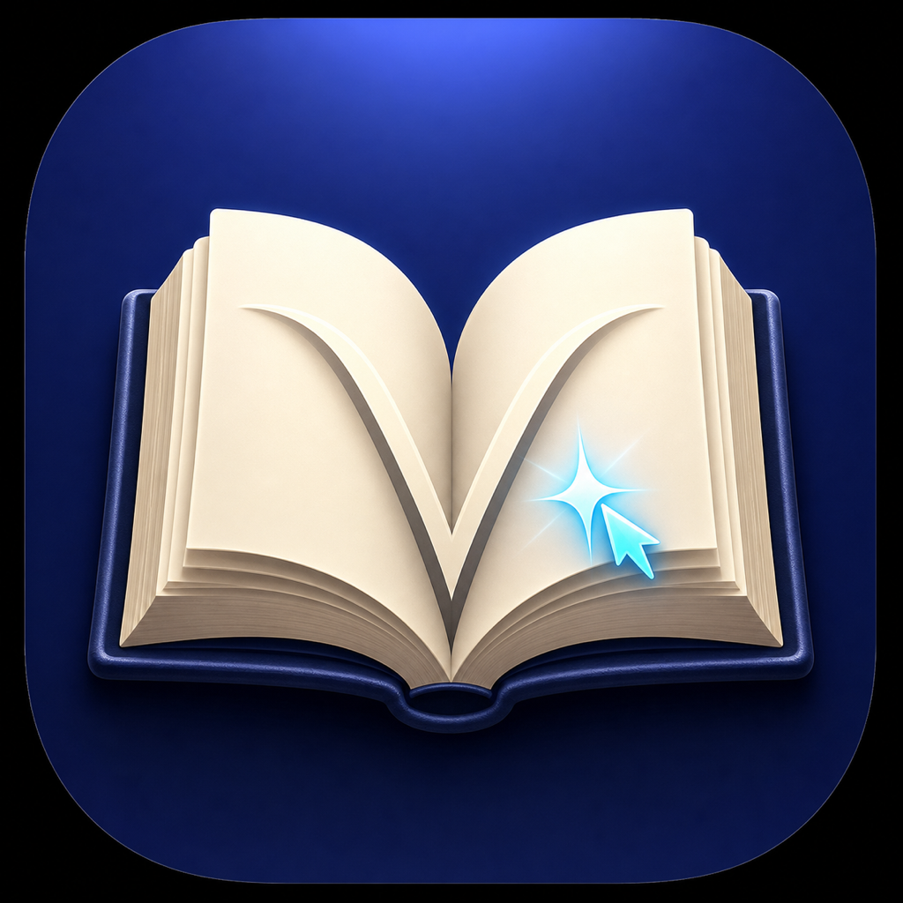

<div align="center">
  
  <h1>LorenVocabulary</h1>
  <p>A native macOS vocabulary assistant for instant selected-text lookup, focused study, and spaced review.</p>
  <p>原生 macOS 划词词典：双击 Control 即查、深度搜索、生词本与闪卡复习。</p>

  [](https://github.com/Loren2008/LorenVocabulary/actions/workflows/ci.yml)
  [](LICENSE)
  [](https://www.apple.com/macos/)
  [](Package.swift)
</div>

> [!IMPORTANT]
> The source code is open source. API credentials, personal learning data, and the project's historical full dictionary database are intentionally not published. The database's complete redistribution rights cannot be proven, so including it under the MIT license would not be responsible. See [Data and licensing](docs/DATA_AND_LICENSING.md).

## 简体中文

### 下载与安装

从 [GitHub Releases](https://github.com/Loren2008/LorenVocabulary/releases/latest) 下载通用版 `.dmg`，将 `IELTS-Vocab.app` 拖入 Applications。安装包同时支持 Apple Silicon 与 Intel Mac。

当前公开构建尚未经过 Apple 公证，因此首次启动需按住 Control 点击 App，选择“打开”并确认；之后可以正常双击启动。首次划词时还需要按系统提示授予辅助功能权限。

### 功能

- 在任意 App 中选中英文，双击 Control，在鼠标附近立即弹出解释。
- 原生 SwiftUI/AppKit 主窗口，支持完整查词与 IELTS 风格语境例句。
- 生词收藏、列表管理、发音和闪卡复习。
- 可选 SQLite 离线词库，支持直接词条和经过验证的合法词形别名。
- macOS 系统词典、本地 JSON 缓存、Free Dictionary API 与 DeepSeek 回退。
- 稳定的本机代码签名流程，减少每次开发构建后重复授权辅助功能。

### 工作方式

```text
双击 Control
  └─ 获取选中文本（完整保存并恢复剪贴板）
      ├─ 可选 SQLite 离线词库
      ├─ 本地 JSON 缓存
      ├─ macOS DictionaryServices
      └─ 网络回退（Free Dictionary API / DeepSeek）
```

主窗口适合深入查词；小弹窗适合快速确认含义。架构细节见 [docs/ARCHITECTURE.md](docs/ARCHITECTURE.md)。

### 系统要求

- macOS 13 Ventura 或更高版本
- Swift 5.9+ / 对应版本 Xcode Command Line Tools
- 可选：DeepSeek API Key，用于系统词典未命中时的网络补全
- 可选：符合授权要求的 `words.db`，用于完整离线体验

### 从源码运行

```bash
git clone https://github.com/Loren2008/LorenVocabulary.git
cd LorenVocabulary

swift test
swift run IELTS-Vocab
```

`swift run` 适合开发调试。若要构建、安装到 `/Applications` 并使用稳定本机签名：

```bash
bash build.sh
```

首次运行 `build.sh` 会创建仅用于本机开发的长期签名身份，macOS 可能要求确认一次证书信任。首次使用划词功能还需在“系统设置 → 隐私与安全性 → 辅助功能”中允许应用。

> `build.sh` 会替换 `/Applications/IELTS-Vocab.app`，但不会修改或重置系统的辅助功能授权数据库。

### 配置 DeepSeek（可选）

打开应用左侧的“API 设置”，或使用菜单“IELTS-Vocab → 设置…”，填写 DeepSeek API Key 和 Base URL。API Key 会保存在 macOS 钥匙串中，不会写入仓库或 App Bundle，保存后立即生效。

无图形界面的自动化环境也可以把模板复制到用户数据目录：

```bash
mkdir -p ~/.ielts-vocab
cp Resources/Config.example.plist ~/.ielts-vocab/Config.plist
chmod 600 ~/.ielts-vocab/Config.plist
open -e ~/.ielts-vocab/Config.plist
```

将 `YOUR_DEEPSEEK_API_KEY` 替换为自己的 Key。数据库构建工具也支持环境变量：

```bash
export DEEPSEEK_API_KEY='your-key-here'
```

请勿把真实 Key 写入 Issue、日志、截图或提交记录。

### 可选离线数据库

公开仓库不会附带历史 `words.db`。没有数据库时，应用仍能通过 macOS 系统词典和网络回退工作。如你拥有可合法再分发或仅供个人使用的数据，可放到：

```text
Resources/words.db            # 构建时嵌入 App，仅限你有权分发的数据
~/.ielts-vocab/words.db       # 仅当前用户使用，不会被提交
```

数据库结构在 [Resources/words.schema.sql](Resources/words.schema.sql)，数据生成与真实性规则见 [docs/DATA_AND_LICENSING.md](docs/DATA_AND_LICENSING.md)。

### 测试

```bash
swift test
python3 -m unittest discover -s Tests -p 'test_expansion_pipeline.py'
bash -n build.sh setup_local_signing.sh BatchBuilder/build.sh
```

CI 会在 GitHub 托管的 macOS runner 上运行同样的 Swift、Python 与 Shell 基础检查，并确认秘密配置和本地数据库没有被提交。

### 参与贡献

欢迎修复 Bug、改进无障碍体验、优化 UI、增强测试或完善安全的数据构建管线。提交前请阅读：

- [CONTRIBUTING.md](CONTRIBUTING.md)
- [CODE_OF_CONDUCT.md](CODE_OF_CONDUCT.md)
- [SECURITY.md](SECURITY.md)

严禁在 Pull Request 中加入未经授权的商业词典内容、真实 IELTS 试题文本、API Key 或个人学习数据。

## English

LorenVocabulary is a native SwiftUI/AppKit dictionary for macOS. Select English text in any application and double-tap Control to open a compact lookup panel. The main window adds richer search, saved words, pronunciation, and flashcard review.

Download the universal `.dmg` from [GitHub Releases](https://github.com/Loren2008/LorenVocabulary/releases/latest) and drag the app to Applications. The current public build is not Apple-notarized, so the first launch requires Control-clicking the app and choosing Open.

### Quick start

```bash
git clone https://github.com/Loren2008/LorenVocabulary.git
cd LorenVocabulary
swift test
swift run IELTS-Vocab
```

Use `bash build.sh` for the locally signed `/Applications/IELTS-Vocab.app` development build. The first run may ask you to trust the local signing identity and grant Accessibility permission.

DeepSeek and a local SQLite database are optional. Configure the API key in the app's Settings window; it is stored in macOS Keychain. Headless tooling may copy `Resources/Config.example.plist` to `~/.ielts-vocab/Config.plist`. The repository intentionally excludes credentials, user data, generated manifests, and the historical full dictionary database.

Before contributing, read [CONTRIBUTING.md](CONTRIBUTING.md). In particular, do not submit copyrighted dictionary definitions, authentic exam passages, secrets, or user data.

## Project status

This is an independently maintained learning project. It is not affiliated with, endorsed by, or sponsored by IELTS, Cambridge University Press & Assessment, the British Council, IDP Education, Apple, DeepSeek, or Oxford University Press. “IELTS” and other names belong to their respective owners.

## License

Source code and repository documentation are licensed under the [MIT License](LICENSE), unless a file says otherwise. That license does **not** automatically cover third-party services, system dictionaries, external datasets, user-provided databases, or generated content whose rights have not been verified. See [THIRD_PARTY_NOTICES.md](THIRD_PARTY_NOTICES.md).
